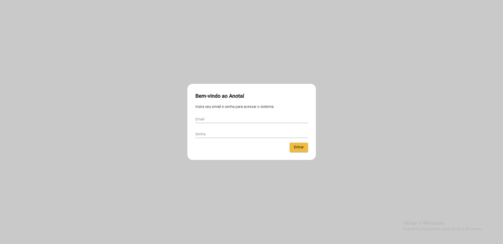
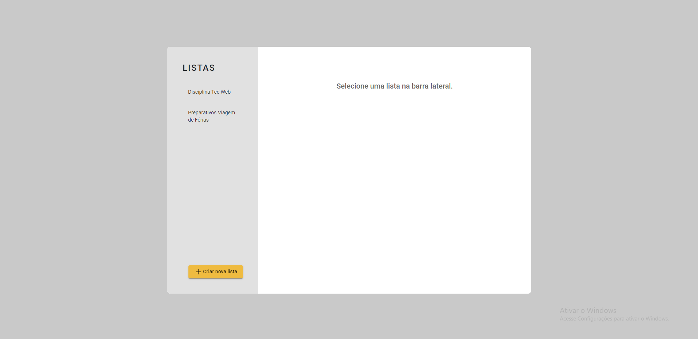
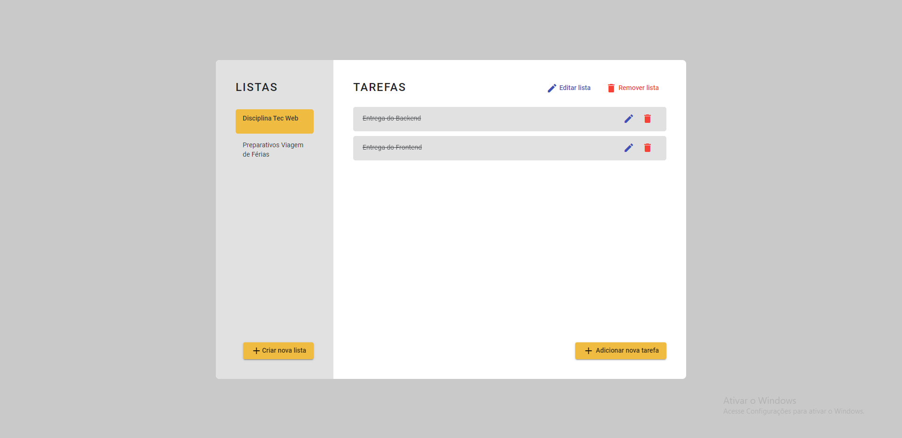
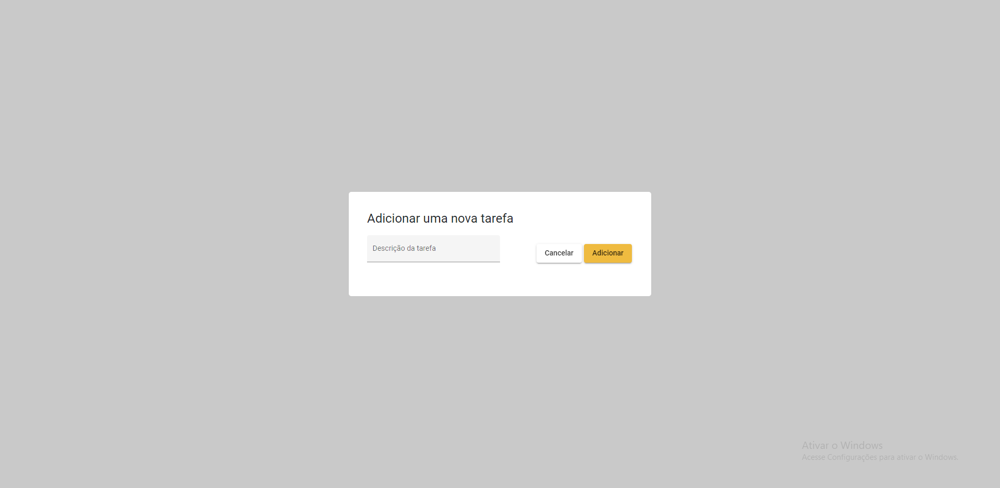

<h4 align="center"> 
 Anotaí App ✔️📄 
</h4>
<p align="center">
  
	
  <a href="https://www.linkedin.com/in/felipe-melo-a78504186/">
    
  </a>

  <a href="https://github.com/felipefrm/todo-list-nodejs-angular/commits/master">
    
  </a>
</p>

<p align="center">
  <a href="#projeto">Projeto</a>&nbsp;&nbsp;&nbsp;|&nbsp;&nbsp;&nbsp;
  <a href="#tecnologias">Tecnologias</a>&nbsp;&nbsp;&nbsp;|&nbsp;&nbsp;&nbsp;
  <a href="#screenshots">Screenshots</a>&nbsp;&nbsp;&nbsp;|&nbsp;&nbsp;&nbsp;
  <a href="#como-usar">Como usar</a>&nbsp;&nbsp;&nbsp;|&nbsp;&nbsp;&nbsp;
  <a href="#como-contribuir">Como contribuir</a>&nbsp;&nbsp;&nbsp;|&nbsp;&nbsp;&nbsp;
</p>


<a id="projeto"></a>
## 💻 Projeto

O Anotaí é uma plataforma que permite ao usuário adicionar listas de tarefas a serem realizadas, proporcionando um maior controle sobre os afazeres e lembretes diários.

<a id="tecnologias"></a>
## :rocket: Tecnologias

Este projeto foi desenvolvido utilizando as seguintes tecnologias:

- [TypeScript][typescript]
- [Node.js][nodejs]
- [Express](https://expressjs.com/pt-br/)
- [JsonWebToken](https://jwt.io/)
- [Cors](https://www.npmjs.com/package/cors)
- [MySQL](https://www.mysql.com/)
- [Angular](angular)


<a id="screenshots"></a>
## 🖥️ Screenshots

#### Web Screenshot
<div>
   
   
   
   
</div>

<a id="como-usar"></a>
## :information_source: Como usar

- ### **Pré-requisitos**

  - É **necessário** possuir o **[Node.js](https://nodejs.org/en/)** instalado na máquina.
  - Também, é **preciso** ter um gerenciador de pacotes seja o **[NPM](https://www.npmjs.com/)** ou **[Yarn](https://yarnpkg.com/)**.
  - É **essencial** ter o **[Angular-CLI](https://angular.io/cli)** instalado de na máquina.
  - Por fim, **precisa-se** subir um servidor local MySQL, importando o arquivo do banco de dados 'backend/anotai.sql' ao servidor.

1. Faça um clone :

```sh
  $ git clone https://github.com/felipefrm/todo-list-nodejs-angular
```

2. Executando o Back-End:

```sh

  # Navegue à pasta do backend
  $ cd /backend

  # Instale as dependências
  $ npm install

  # Inicie o backend
  $ npm start
```
3. Executando o Front-End:

```sh
  # Navegue à pasta do frontend
  $ cd /frontend
  
  # Instale as dependências
  $ npm install
  
  # Inicie o frontend
  $ ng serve --open
  
  # A aplicação estará rodando no endereço: localhost:4200
```
  
  

<a id="como-contribuir"></a>
## 🤔 Como contribuir

- Faça um fork;
- Crie uma branch com a sua feature: `git checkout -b my-feature`;
- Faça um commit com suas mundaças: `git commit -m 'feat: My new feature'`;
- Dê um push para sua branch: `git push origin my-feature`.


<h4 align="center">
     Feito por 💜  <a href="https://www.linkedin.com/in/felipe-melo-a78504186/" target="_blank">Felipe Melo</a>
</h4>

[nodejs]: https://nodejs.org/
[typescript]: https://www.typescriptlang.org/


